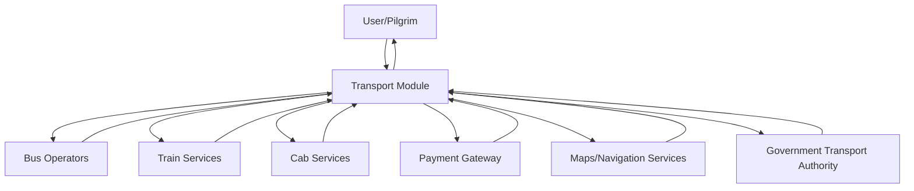

# Data Flow Diagram - Level 0 (Context Diagram)
## Transport Module - Kumbh Sahyogi System

## External Entities

1. **User/Pilgrim**: End users seeking transport services during Kumbh Mela
2. **Bus Operators**: City bus and inter-city bus services (MSRTC, Private operators)
3. **Train Services**: Railway services and booking systems
4. **Cab Services**: Taxi and cab operators (Uber, Ola, local cabs)
5. **Payment Gateway**: Third-party payment processing services
6. **Maps/Navigation Services**: External mapping and GPS services
7. **Government Transport Authority**: Transport regulatory and scheduling authorities

## Main Processes

The Transport Module serves as the central hub that:
- Manages inter-city transport bookings (bus, train, cab)
- Provides city bus route planning and schedules
- Handles transport reservations and payments
- Provides navigation and route planning
- Manages real-time transport updates
- Processes transport-related payments
