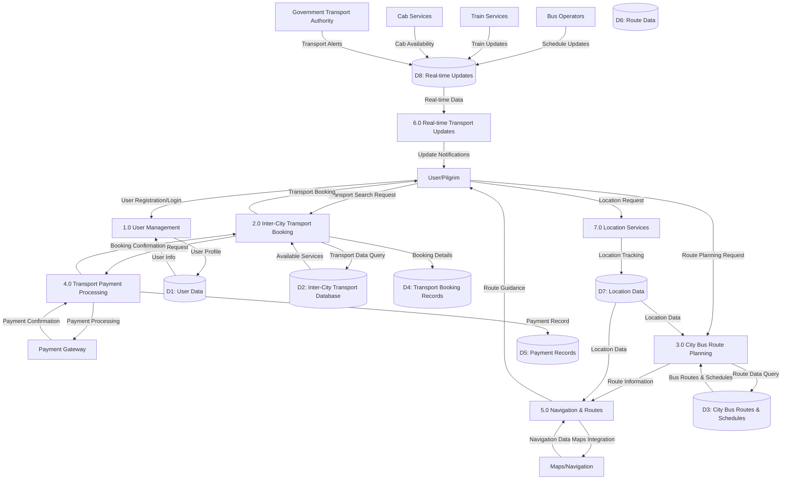

# Data Flow Diagram - Level 1
## Transport Module - Major Processes

## Data Flows

### Input Flows
- User registration/login data
- Transport search criteria (origin, destination, date, time)
- City bus route planning requests
- Transport booking requests
- Payment information
- Location/GPS data
- Real-time transport updates

### Output Flows
- Transport booking confirmations
- City bus route recommendations
- Navigation instructions and maps
- Real-time transport updates
- Payment receipts
- Location-based transport suggestions

### Data Stores
- **D1: User Data** - User profiles, preferences, transport booking history
- **D2: Inter-City Transport Database** - Bus/train/cab schedules, routes, pricing, availability
- **D3: City Bus Routes & Schedules** - Nashik city bus routes, timings, stops, frequencies
- **D4: Transport Booking Records** - All transport booking transactions and confirmations
- **D5: Payment Records** - Transport payment transaction history and status
- **D6: Route Data** - Navigation routes, traffic information, GPS coordinates
- **D7: Location Data** - User location, nearby transport stops, GPS coordinates
- **D8: Real-time Updates** - Live transport schedules, delays, cancellations, availability
