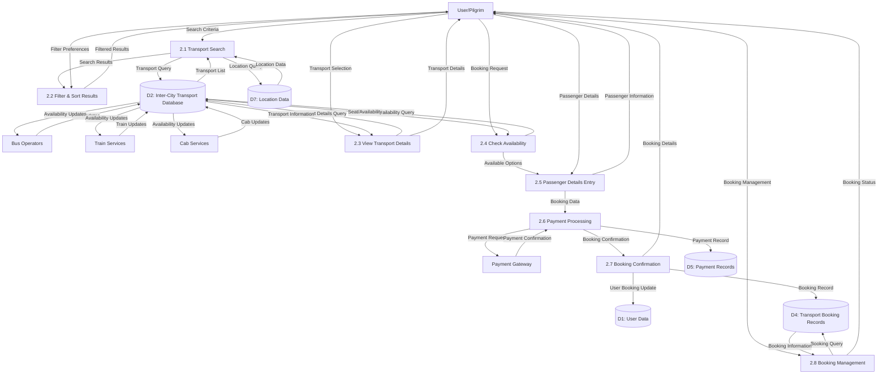
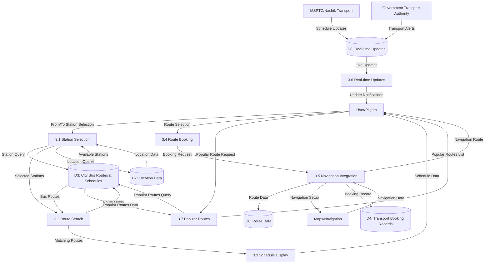
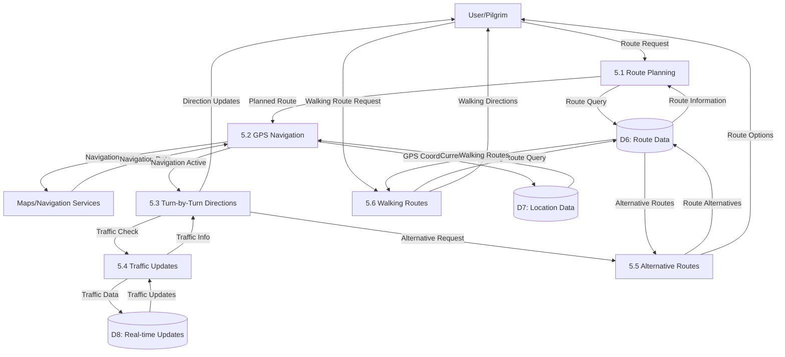

# Data Flow Diagram - Level 2
## Transport Module - Detailed Process Breakdown

## Inter-City Transport Booking System (Process 2.0)

## City Bus Route Planning System (Process 3.0) - Level 2

## Navigation & Routes System (Process 5.0) - Level 2

## Key Data Flows at Level 2

### Inter-City Transport Booking System
- **Search Criteria**: Origin, destination, date, time, passenger count
- **Transport Information**: Service type, operator, schedules, pricing, availability
- **Passenger Details**: Names, contact info, age, seat preferences
- **Payment Data**: Amount, payment method, transaction ID
- **Booking Confirmation**: Booking ID, transport details, journey dates, seat numbers

### City Bus Route Planning System
- **Station Selection**: From station, to station, preferred time
- **Route Data**: Bus number, route name, via stations, departure/arrival times
- **Schedule Information**: Frequency, operating hours, fare structure
- **Navigation Integration**: GPS coordinates, turn-by-turn directions
- **Real-time Updates**: Schedule changes, delays, route modifications

### Navigation & Routes System
- **Route Planning**: Origin, destination, mode of transport, preferences
- **GPS Data**: Current location, destination coordinates, route waypoints
- **Navigation Instructions**: Turn-by-turn directions, distance, estimated time
- **Traffic Information**: Real-time traffic conditions, alternative routes
- **Walking Routes**: Pedestrian-friendly paths, walking time estimates
